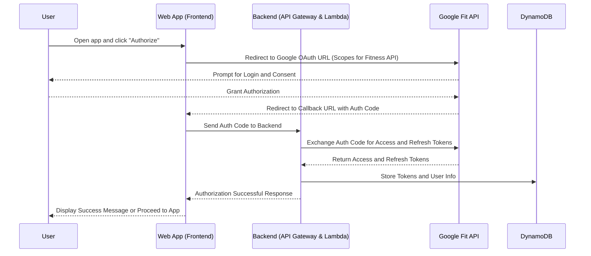

A game that integrats with Google Fit as a source of currency. The idea is to encourage users to move and acquire _Heart Points_ in a non-competitive and encouraging manner.

# Google Fit Integration

